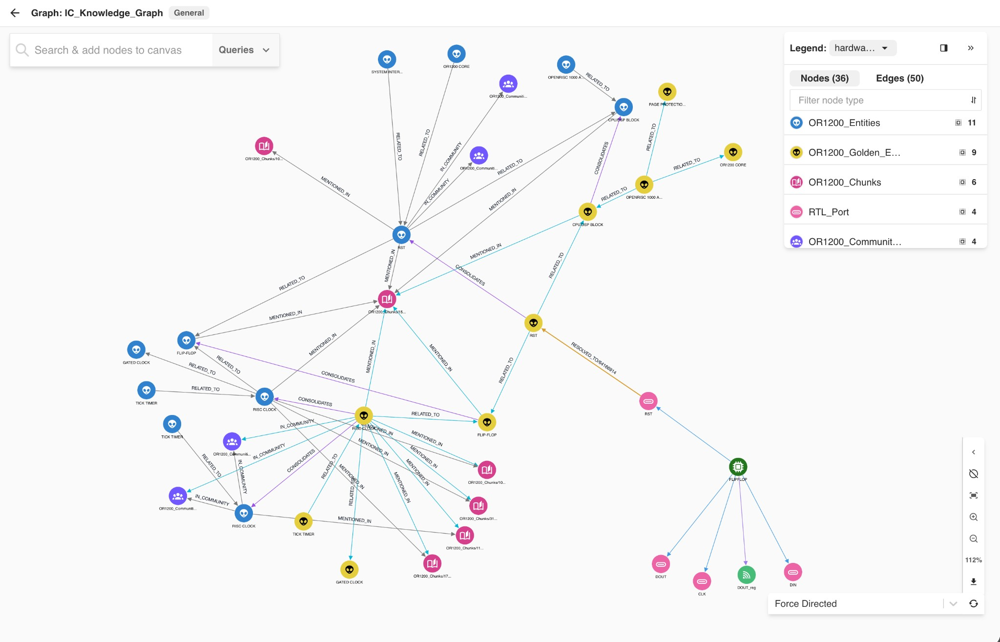
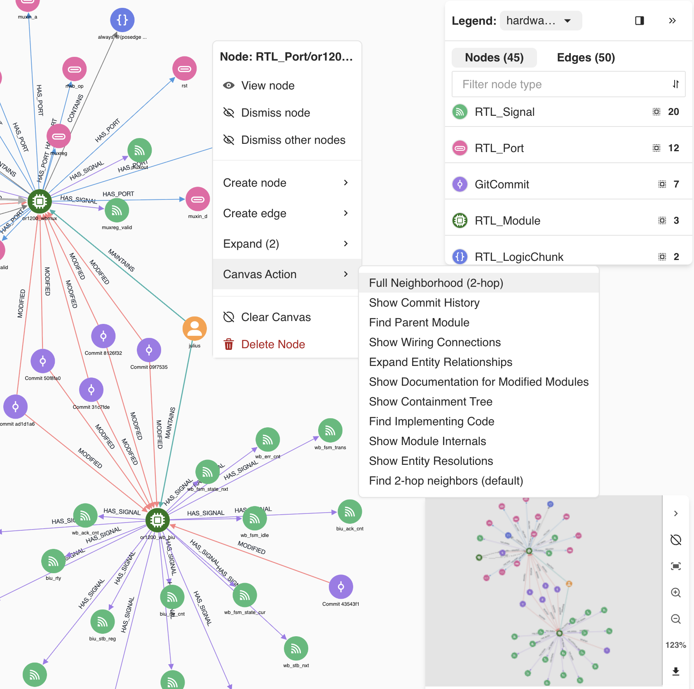
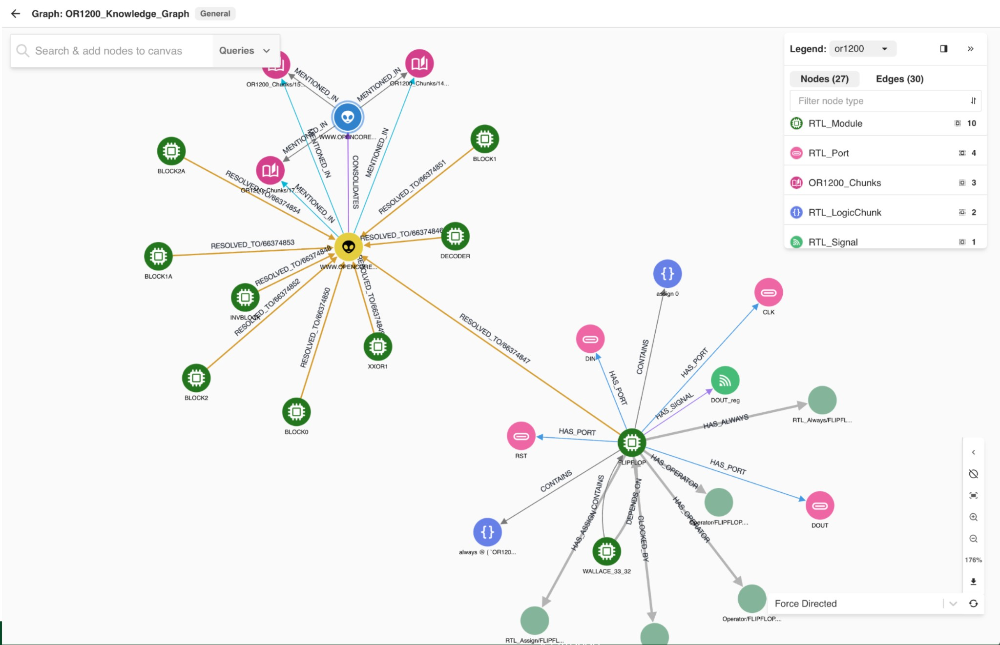

# Integrated Circuit Design Knowledge Graph Demo

This demonstration showcases the power of **ArangoDB** in harmonizing structured integrated circuit (IC) hardware design (RTL/Verilog), temporal version history (Git), and unstructured technical specifications (GraphRAG) into a single, queryable knowledge graph. The current implementation uses the **OR1200 RISC processor** as sample data.



*Bridging (RESOLVED_TO edges) and consolidation: entities found in disparate documents are merged into Golden Entities and linked to RTL components (e.g. RTL_Port → Golden Entity).*

## Research Foundations

This project is a modern implementation of the principles established in the **Design Knowledge Management System (DKMS)** research program co-authored for the Air Force Materiel Command (1989-1992). It realizes the vision of a "Semantic Bridge" between design intent and implementation that was pioneered in these foundational reports.

For details on the theoretical foundations, see [docs/research/DKMS_Foundations.md](docs/research/DKMS_Foundations.md).

## Visualizing the Knowledge Graph

### Global Schema
The knowledge graph harmonizes three disparate data silos: RTL code structure, Git history, and technical specifications.



*Figure 1: The conceptual schema showing the relationships between Authors, Commits, RTL Elements, and Documentation Chunks.*

### The Semantic Bridge
The core value of this project is the **Semantic Bridge**, which connects unstructured documentation (GraphRAG) to structured hardware implementation (RTL). Below is a visualization from the ArangoDB Graph Visualizer showing a **Documentation Entity** (center) resolved to multiple **RTL Modules** (the "Flip-Flop" logic block hierarchy).



*Figure 2: Visualizer showing documentation entities resolved to specific RTL modules, ports, and logic chunks.*

## Key Features

- **Semantic Bridge**: Automatically links Verilog modules, ports, and signals to entities referenced in corresponding documentation sections using lexical analysis.
- **High-Performance Consolidation**: Uses set-based AQL operations for near-instant (sub-second) entity resolution across thousands of documentation nodes.
- **Temporal Insight**: Ingests full Git history to allow "Time-Travel" queries across the evolution of the hardware design.
- **Author Expertise Mapping**: First-class contributor vertices enable knowledge transfer, collaboration analysis, and bus factor assessment.
- **Granular RTL Graph**: Decomposes monolithic Verilog files into a rich graph of `Module`, `Port`, `Signal`, and `LogicChunk` nodes.
- **GraphRAG Augmented**: Integrated with high-quality entity and community extraction from the Arango AI team's GraphRAG pipeline.

## Project Structure

- `src/`: Core ETL and bridging scripts.
- `docs/`: Comprehensive documentation (see [docs/README.md](docs/README.md))
    - `project/`: Core project docs (Walkthrough, Schema, PRD)
    - `development/`: Development phase history
    - `er-library-contribution/`: ER Library contribution story
    - `migration/`: Migration documentation
    - `testing/`: Test reports
    - `reference/`: Technical references
- `tests/`: Unit tests for parsing and normalization logic.
- `or1200/`: The source RTL repository (submodule).
- `validation/`: Ground truth datasets and validation scripts.

## Setup & Usage

### 1. Prerequisites
- Python 3.8+
- ArangoDB instance (local Docker or remote)

### 2. Environment Configuration
Copy `env.template` to `.env` in the root directory and configure your settings:

```bash
cp env.template .env
```

Then edit `.env` with your specific values:

```env
# Choose LOCAL or REMOTE mode
ARANGO_MODE=LOCAL

# For REMOTE mode, configure these:
ARANGO_ENDPOINT=https://your-instance.arango.ai
ARANGO_USERNAME=root
ARANGO_PASSWORD=your_password
ARANGO_DATABASE=ic-knowledge-graph

# For LOCAL mode (Docker), configure these:
LOCAL_ARANGO_ENDPOINT=http://localhost:8530
LOCAL_ARANGO_USERNAME=root
LOCAL_ARANGO_PASSWORD=
LOCAL_ARANGO_DATABASE=ic-knowledge-graph

# GraphRAG prefix for collection names
GRAPHRAG_PREFIX=OR1200_
```

### 3. Install Dependencies

```bash
pip install -r requirements.txt
```

**Key Dependencies:**
- `arango-entity-resolution==3.1.0` - Official PyPI package for entity resolution
  - Provides `WeightedFieldSimilarity` for multi-field scoring (name + description)
  - Lazy loading ensures fast startup times
  - No manual configuration required

### 3b. Install agentic graph analytics (required for analytics reports)

This repo runs analytics via the `agentic-graph-analytics` project. Install from source (editable):

```bash
cd ~/code/agentic-graph-analytics
git pull origin main
pip install -e .
```

Ensure `.env` has valid ArangoDB credentials—the workflow uses JWT for GRAL; tokens expire during long runs and are auto-refreshed using `ARANGO_ENDPOINT`, `ARANGO_USER` (or `ARANGO_USERNAME`), and `ARANGO_PASSWORD`.

### 4. Running the Pipeline
The entire ingestion and bridging process is orchestrated via:
```bash
./src/import_all.sh
python3 src/create_graph.py
python3 src/bridger.py
python3 src/etl_authors.py  # Optional: Author expertise mapping
```

**Author Expertise Mapping** (optional but recommended):
- Extracts 8 unique authors from Git commits
- Creates AUTHORED edges (author → commit)
- Creates MAINTAINS edges (author → module) based on commit frequency
- Enables expertise queries, bus factor analysis, and collaboration networks

### 5. Verification
Run the test suite to ensure the environment is correctly configured:
```bash
pytest tests/
```

## Agentic analytics (reports)

Once your ArangoDB database is populated (pipeline above), run:

```bash
python run_ic_analysis.py
```

Reports are written to `ic_analysis_output/` as both Markdown and interactive HTML.

## Visualization
The "Semantic Bridge" can be explored visually via the **ArangoDB Dashboard**:
1. Go to **Graphs** -> **OR1200_Knowledge_Graph**.
2. Identify cross-model links: `(RTL_Module) -[RESOLVED_TO]-> (OR1200_Golden_Entities)`.

## Demo Materials

Complete demonstration materials are available:

1. **Quick Start**: Read `docs/DEMO_EXECUTIVE_SUMMARY.md` (5-minute overview)
2. **Setup Theme**: Run `python scripts/setup/install_theme.py` to install the 'hardware-design' visualization theme
3. **Setup Queries**: Run `python scripts/setup/install_demo_setup.py` to install queries and actions
4. **Demo Guide**: Follow `docs/DEMO_SCRIPT.md` for a comprehensive demonstration
5. **Preparation**: Use `docs/DEMO_README.md` for setup checklist and troubleshooting

The demo showcases:
- Hierarchical semantic bridges (spec → code)
- Temporal design audit (time-travel queries)
- Type-safe entity resolution
- Sub-200ms graph traversals
- Agent integration for 10x token savings

---
*For technical details, see the [Project Walkthrough](docs/project/WALKTHROUGH.md).*
