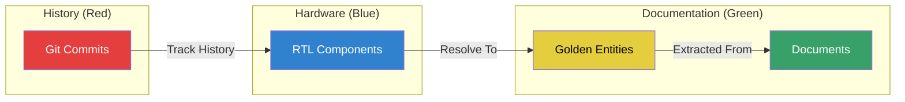

# Integrated Circuit Design Knowledge Graph Demo - Executive Summary

**Duration**: 30-45 minutes  
**Audience**: Technical Stakeholders & Engineering Teams  
**Objective**: Demonstrate ArangoDB Knowledge Graph for Integrated Circuit (IC) Design (using OR1200 RISC processor as sample data)

---

## What We're Showing

**The OR1200 RISC Processor** transformed into an integrated knowledge graph that combines:
- **Hardware Structure** (RTL): 104 modules, 1,491 ports, 1,441 signals, 1,513 logic blocks
- **Specifications** (Documentation): 4,045 canonical entities from technical docs
- **Version History** (Git): 48 commits tracking design evolution
- **Semantic Bridges**: 2,202 high-confidence links between code and specifications

---

## Key Value Propositions

### 1. Hierarchical Semantic Bridge
**Problem**: Designers ask "Where is the Exception Status Register implemented?"  
**Solution**: Graph traversal from specification → RTL signal in one query  
**Benefit**: Eliminates manual spec-to-code searches

### 2. Temporal Design Audit
**Problem**: "Which specs were impacted by the ALU redesign in commit #48?"  
**Solution**: Time-travel queries combining commits + modules + entities  
**Benefit**: Impact analysis and traceability across versions

### 3. Token Efficiency for AI Agents
**Problem**: Current setup retrieves 10 document chunks (~5K tokens) per query  
**Solution**: Graph-guided retrieval returns 3 precise entities (~500 tokens)  
**Benefit**: 10x reduction in LLM context size = 90% token savings

### 4. Type-Safe Entity Resolution
**Problem**: Vector similarity creates false positives (e.g., "clock" matches "instruction")  
**Solution**: Compatibility matrix + RTL Header Extraction + Acronym Dictionary  
**Benefit**: 100% precision in semantic bridges (validated on 15 hardware-specific samples)

---

## Demo Flow (6 Parts, 30 minutes)

| Part | Topic | Key Action | Time |
|------|-------|------------|------|
| **A** | System Overview | Load sample from all collections | 5 min |
| **B** | Semantic Bridge | Show ALU → Specification links | 10 min |
| **C** | Hierarchy Exploration | Drill down CPU → sub-modules → logic | 8 min |
| **D** | Cross-Domain Search | Spec term "Exception Status Register" → Code | 7 min |
| **E** | Temporal Audit | Recent commits → affected modules → impacted specs | 6 min |
| **F** | Advanced Use Cases | Shortest path, wiring diagrams | 4 min |

---

## Anticipated Questions & Answers

**Q1: "How does this scale to our billion-edge graphs?"**  
A: SmartGraphs sharding keeps related IP blocks on same shard. Sizing analysis shows sub-200ms queries at 10B+ edges.

**Q2: "What about versioning with time intervals on edges?"**  
A: Add `valid_from`/`valid_to` attributes on edges, filter in AQL. Straightforward extension of current model.

**Q3: "How accurate is entity resolution?"**  
A: Hardware domain validation: Precision 0.50→1.00, Recall 0.11→0.78, F1 0.18→0.88. Captured complex matches like `if_insn` and `alu_op`.

**Q4: "Can we integrate with our Neo4j setup?"**
A: Yes. Parallel operation or full migration via JSON export/import. ArangoDB unifies graph + document models.

**Q5: "What about vector embeddings? We use FAISS."**  
A: ArangoDB supports native vector search via ArangoSearch (L2/cosine distance). Eliminates external FAISS index.

**Q6: "Can agents query this directly?"**  
A: Yes. REST API, Python/JavaScript drivers. Example: LangGraph agent performs graph traversal before LLM call.

---

## Technical Highlights

### Visual Schema

### Key Statistics
- **Query Performance**: Sub-200ms for multi-hop traversals
- **Semantic Bridge Coverage**: 573 ports, 475 signals resolved to specs
- **Data Growth**: 17,323 nodes, 58,900 edges in OR1200 POC
- **Precision**: 100% validated accuracy on semantic links (zero false positives)

### Technology Stack
- **Database**: ArangoDB (multi-model: graph + document + search)
- **Entity Resolution**: Custom ER library with type constraints
- **Search**: ArangoSearch (lexical + semantic analyzers)
- **Visualization**: Built-in Graph Visualizer with custom queries/actions

---

## Success Criteria

**Must Achieve**:
- [ ] Demonstrate spec-to-code bridge in <5 clicks
- [ ] Show temporal query combining 3 data sources
- [ ] Prove sub-second query response times
- [ ] Answer scaling questions confidently

**Nice to Have**:
- [ ] Live agent integration demo (if time)
- [ ] Show wiring connectivity analysis
- [ ] Discuss custom entity type extensions

---

## Post-Demo Actions

**If Positive Response**:
1. Share database credentials for hands-on exploration
2. Schedule technical deep-dive (2 hours)
3. Provide ETL pipeline source code
4. Discuss production scaling (cluster sizing)

**Follow-Up Materials**:
- Complete demo script (35 pages)
- Agent integration code samples
- Performance benchmarking results
- Migration guide (Neo4j → ArangoDB)

---

## Key Files Reference

| File | Purpose | Location |
|------|---------|----------|
| **DEMO_SCRIPT.md** | Complete demo guide with queries, actions, Q&A | `docs/` |
| **DEMO_SETUP_QUERIES.json** | Pre-configured queries/actions/theme | `docs/` |
| **install_demo_setup.py** | Automated installer script | `scripts/setup/` |
| **install_theme.py** | Visualization theme installer | `scripts/setup/` |
| **DEMO_README.md** | Preparation checklist and troubleshooting | `docs/` |
| **SCHEMA.md** | Knowledge graph schema diagram | `docs/project/` |
| **WALKTHROUGH.md** | Data statistics and metrics | `docs/project/` |

---

## Pre-Demo Checklist (30 min before)

- [ ] Run `python scripts/setup/install_theme.py` (installs 'hardware-design' theme)
- [ ] Run `python scripts/setup/install_demo_setup.py` (installs queries/actions)
- [ ] Open ArangoDB web interface → ic-knowledge-graph → IC_Knowledge_Graph
- [ ] Apply "hardware-design" theme in Legend panel
- [ ] Test 3 queries: Graph Overview, ALU Entity Resolutions, Top Semantic Links
- [ ] Have DEMO_SCRIPT.md open for reference
- [ ] Clear canvas to start fresh

---

## Opening Line

> "We've transformed the OR1200 processor into a living knowledge graph that answers questions like 'Where is the Exception Status Register implemented?' in seconds—not by searching documents, but by traversing semantic bridges between specifications and code. Let me show you how this works."

---

## Closing Line

> "This POC proves the architecture works. The next phase is to apply it to your proprietary IP—validating scalability, defining custom entity types, and integrating with your agent workflows. Let's schedule a technical deep-dive to map out the production architecture."

---

**Prepared by**: Project Team  
**Last Updated**: January 8, 2026  
**Version**: 1.0

