# Knowledge Graph Schema

This document defines the structure of the **IC Knowledge Graph**, including the relationships between hardware design (RTL), version history (Git), and architectural specifications (GraphRAG).

## 1. Schema Diagram

```mermaid
graph TB
    %% Node Definitions
    subgraph hardware ["Hardware (RTL) - Structured"]
        Module["RTL_Module<br/>(Green/Blue)<br/>104 nodes"]
        Port["RTL_Port<br/>(Pink)<br/>1,491 nodes"]
        Signal["RTL_Signal<br/>(Green)<br/>1,441 nodes"]
        Logic["RTL_LogicChunk<br/>(Purple)<br/>1,513 nodes"]
        FSM["FSM_StateMachine<br/>(Teal)<br/>4 state machines"]
        State["FSM_State<br/>(Light Teal)<br/>23 states"]
        Parameter["RTL_Parameter<br/>(Orange)<br/>221 nodes"]
        Memory["RTL_Memory<br/>(Red)<br/>8 nodes"]
        Clock["ClockDomain<br/>(Blue)<br/>6 nodes"]
        Bus["BusInterface<br/>(Gold)<br/>22 nodes"]
        MPort["MemoryPort<br/>(Red)<br/>8 nodes"]
        Op["Operator<br/>(Orange)<br/>200 nodes"]
        Gen["GenerateBlock<br/>(Purple)<br/>0 nodes"]
    end

    subgraph history ["History (Git) - Temporal"]
        Commit["GitCommit<br/>(Purple)<br/>48 nodes"]
        Author["Author<br/>(Orange)<br/>8 contributors"]
    end
    
    %% Author relationships
    Author -->|AUTHORED| Commit

    subgraph documentation ["Documentation (GraphRAG) - Unstructured"]
        Entities["OR1200_Entities<br/>(Light Green)<br/>5,793 raw entities"]
        Golden["OR1200_Golden_Entities<br/>(Gold)<br/>4,045 canonical entities"]
        Communities["OR1200_Communities<br/>(Light Blue)<br/>478 clusters"]
        Chunk["OR1200_Chunks<br/>(Green)<br/>187 chunks"]
        Doc["OR1200_Documents<br/>(Green)<br/>7 documents"]
    end
    
    %% Entity Resolution (deduplication)
    Entities -.->|Entity Resolution<br/>deduplication| Golden

    %% Hardware Internal Relationships
    Module -->|CONTAINS| Module
    Module -->|CONTAINS| Logic
    Module -->|HAS_PORT| Port
    Module -->|HAS_SIGNAL| Signal
    Module -->|DEPENDS_ON| Module
    Module -->|HAS_FSM| FSM
    Module -->|HAS_PARAMETER| Parameter
    Module -->|HAS_MEMORY| Memory
    Module -->|IMPLEMENTS| Bus
    Module -->|CLOCKED_BY| Clock
    Port -.->|WIRED_TO| Port
    Port -->|PART_OF_BUS| Bus
    Signal -->|CLOCKED_BY| Clock
    Signal -->|RESET_BY| Signal
    Signal -.->|CROSSES_DOMAIN| Clock
    Signal -->|USES_OPERATOR| Op
    Logic -->|ACCESSES| Memory
    Logic -->|USES_OPERATOR| Op
    Logic -->|CALLS| Logic
    Memory -->|MEMORY_PORT| MPort
    Port -->|PART_OF_BUS| MPort
    Module -->|OVERRIDES| Parameter
    Module -->|CONTAINS| Gen
    
    %% FSM Relationships
    FSM -->|HAS_STATE| State
    State -->|TRANSITIONS_TO| State
    FSM -.->|STATE_REGISTER| Signal
    FSM -.->|IMPLEMENTED_BY| Logic
    
    %% Temporal Relationships
    Commit -->|MODIFIED| Module
    Author -->|MAINTAINS| Module
    
    %% Semantic Bridges (dashed to emphasize special relationship)
    Module -.->|RESOLVED_TO<br/>Semantic Bridge| Golden
    Port -.->|RESOLVED_TO| Golden
    Signal -.->|RESOLVED_TO| Golden
    
    %% Documentation References
    Logic -->|REFERENCES| Chunk
    
    %% Documentation Internal Relationships
    Entities -->|OR1200_Relations| Entities
    Entities -->|OR1200_Relations| Chunk
    Entities -->|OR1200_Relations| Communities
    Golden -->|OR1200_Relations| Golden
    Chunk -->|PART_OF| Doc
    
    %% Styling
    style Module fill:#48bb78,stroke:#2d8659,stroke-width:2px
    style Port fill:#ed64a6,stroke:#c4428a,stroke-width:2px
    style Signal fill:#48bb78,stroke:#2d8659,stroke-width:2px
    style Logic fill:#667eea,stroke:#4c54c7,stroke-width:2px
    style FSM fill:#38b2ac,stroke:#2c7a7b,stroke-width:2px
    style State fill:#4fd1c5,stroke:#38b2ac,stroke-width:2px
    style Parameter fill:#f6ad55,stroke:#dd6b20,stroke-width:2px
    style Memory fill:#fc8181,stroke:#e53e3e,stroke-width:2px
    style Clock fill:#3182ce,stroke:#2b6cb0,stroke-width:2px
    style Bus fill:#d69e2e,stroke:#b7791f,stroke-width:2px
    style MPort fill:#f56565,stroke:#c53030,stroke-width:2px
    style Op fill:#ed8936,stroke:#c05621,stroke-width:2px
    style Gen fill:#667eea,stroke:#4c54c7,stroke-width:2px
    style Entities fill:#d4edda,stroke:#9ac9a8,stroke-width:2px
    style Golden fill:#e5ce3e,stroke:#c7a91a,stroke-width:3px
    style Communities fill:#cce5ff,stroke:#99c2e6,stroke-width:2px
    style Chunk fill:#90ee90,stroke:#6db36d,stroke-width:2px
    style Doc fill:#90ee90,stroke:#6db36d,stroke-width:2px
    style Commit fill:#9f7aea,stroke:#7c5ac7,stroke-width:2px
    style Author fill:#ff9f40,stroke:#e67e22,stroke-width:2px
    
    style hardware fill:#f0f9ff
    style history fill:#faf5ff
    style documentation fill:#fffbeb
```


<details>
<summary>View Mermaid Source</summary>


</details>

## 2. Data Dictionary

### Node Collections

| Collection Name | Description | Key Properties |
| :--- | :--- | :--- |
| **`RTL_Module`** | High-level Verilog modules. | `label`, `metadata.file`, `metadata.code_content`, `metadata.summary` |
| **`RTL_Port`** | Module interface pins (I/O). | `label`, `metadata.direction` (input/output) |
| **`RTL_Signal`** | Internal wires and registers. | `label`, `metadata.signal_type` (wire/reg) |
| **`RTL_LogicChunk`** | Behavioral units (always/assign). | `label`, `metadata.code`, `metadata.chunk_type` |
| **`FSM_StateMachine`** | Extracted finite state machines (4 in OR1200). | `name`, `state_register`, `state_count`, `parent_module`, `metadata.encoding_type` |
| **`FSM_State`** | Individual states within FSMs (23 total). | `name`, `encoding`, `fsm_id`, `metadata.is_reset_state` |
| **`RTL_Parameter`** | Design parameters and localparams. | `name`, `value`, `evaluated_value`, `parent_module` |
| **`RTL_Memory`** | Extracted RAM/ROM arrays and register files. | `name`, `width`, `depth`, `total_bits`, `parent_module` |
| **`ClockDomain`** | Clock domains and timing boundaries. | `name`, `clock_signal`, `metadata.edge` |
| **`BusInterface`** | Logical bus groupings (AXI, Wishbone). | `name`, `interface_type`, `port_count`, `parent_module` |
| **`MemoryPort`** | Structured memory interfaces (addr, data, we). | `name`, `parent_module`, `metadata.memory` |
| **`Operator`** | Arithmetic and logical operators (Adder, etc.). | `name`, `operator_type`, `parent_module` |
| **`GenerateBlock`** | Parameterized generate blocks and loops. | `name`, `parent_module`, `loop_count`, `loops` |
| **`GitCommit`** | Temporal history nodes. | `hash`, `author`, `timestamp`, `message` |
| **`Author`** | Hardware engineers/contributors. | `name`, `email`, `email_variations`, `metadata.total_commits`, `metadata.active`, `metadata.team`, `metadata.role` |
| **`OR1200_Entities`** | Raw entities from GraphRAG extraction. | `entity_name`, `entity_type`, `description` |
| **`OR1200_Golden_Entities`** | Canonical entities (deduplicated). | `entity_name`, `entity_type`, `description`, `aliases` |
| **`OR1200_Communities`** | Community clusters of related entities. | `community_id`, `entities`, `summary` |
| **`OR1200_Chunks`** | Text blocks from specifications. | `content`, `metadata.page_number` |
| **`OR1200_Documents`** | Source PDF file references. | `file_name`, `metadata.source_url` |

### Edge Collections

| Edge Name | From | To | Description |
| :--- | :--- | :--- | :--- |
| **`CONTAINS`** | `RTL_Module` | `RTL_Module` | Hierarchical submodule instantiation. |
| **`CONTAINS`** | `RTL_Module` | `RTL_LogicChunk` | Encapsulation of behavior within a module. |
| **`DEPENDS_ON`** | `RTL_Module` | `RTL_Module` | Module instantiation dependencies (e.g., CPU depends on ALU). Includes `instance_count` and `instance_names` metadata. |
| **`HAS_PORT`** | `RTL_Module` | `RTL_Port` | Links a module to its interface pins. |
| **`HAS_SIGNAL`** | `RTL_Module` | `RTL_Signal` | Links a module to its internal registers/wires. |
| **`HAS_FSM`** | `RTL_Module` | `FSM_StateMachine` | Links modules containing state machines. |
| **`HAS_STATE`** | `FSM_StateMachine` | `FSM_State` | Connects FSMs to their individual states. |
| **`TRANSITIONS_TO`** | `FSM_State` | `FSM_State` | State transitions with condition metadata. |
| **`STATE_REGISTER`** | `FSM_StateMachine` | `RTL_Signal` | Links FSM to the signal that holds its state. |
| **`IMPLEMENTED_BY`** | `FSM_StateMachine` | `RTL_LogicChunk` | Links FSM to the always block implementing it. |
| **`HAS_PARAMETER`** | `RTL_Module` | `RTL_Parameter` | Links a module to its design parameters. |
| **`HAS_MEMORY`** | `RTL_Module` | `RTL_Memory` | Links a module to its memory arrays. |
| **`CLOCKED_BY`** | `Logic/Signal` | `ClockDomain` | Timing dependency on a clock domain. |
| **`RESET_BY`** | `RTL_Signal` | `RTL_Signal` | Reset dependency (async or sync). |
| **`CROSSES_DOMAIN`** | `RTL_Signal` | `ClockDomain` | Clock Domain Crossing (CDC) detected. |
| **`IMPLEMENTS`** | `RTL_Module` | `BusInterface` | Module implementation of a bus protocol. |
| **`PART_OF_BUS`** | `Port/Signal` | `BusInterface` | Grouping of signals into a logical bus. |
| **`OVERRIDES`** | `RTL_Module` | `RTL_Parameter` | Parameter overrides during instantiation. |
| **`ACCESSES`** | `RTL_LogicChunk` | `RTL_Memory` | Memory read/write operations with index info. |
| **`MEMORY_PORT`** | `RTL_Memory` | `MemoryPort` | Link between memory array and its interface. |
| **`USES_OPERATOR`** | `Logic/Signal` | `Operator` | Hardware resource usage (arithmetic/logic). |
| **`CALLS`** | `Logic/Function` | `RTL_Function` | Call graph relationships. |
| **`WIRED_TO`** | `RTL_Port` | `RTL_Port` | Port connectivity within modules. |
| **`MODIFIED`** | `GitCommit` | `RTL_Module` | Tracks which modules were changed in a commit. |
| **`AUTHORED`** | `Author` | `GitCommit` | Links authors to their commits. |
| **`MAINTAINS`** | `Author` | `RTL_Module` | Derived relationship showing module expertise (≥3 commits or ≥20% of commits). |
| **`RESOLVED_TO`** | `RTL_*` | `OR1200_Golden_Entities` | **Semantic Bridge**: Type-safe links between code and spec (2,202 total, 87.6% increase from enhancements). |
| **`REFERENCES`** | `RTL_LogicChunk` | `OR1200_Chunks` | **Evidence Link**: Direct reference to a spec paragraph. |
| **`OR1200_Relations`** | `OR1200_Entities` | `OR1200_Entities` | Relationships between raw entities. |
| **`OR1200_Relations`** | `OR1200_Entities` | `OR1200_Chunks` | Entity references to source text chunks. |
| **`OR1200_Relations`** | `OR1200_Entities" | `OR1200_Communities` | Entity membership in communities. |
| **`OR1200_Relations`** | `OR1200_Golden_Entities" | `OR1200_Golden_Entities` | Relationships between canonical entities. |
| **`WIRED_TO`** | `RTL_Port` | `RTL_Port` | Structural connectivity between module ports. |

## 3. Collection Statistics

The following table provides the current counts and average document sizes for all collections in the `ic-knowledge-graph` database (as of Jan 8, 2026).

| Collection Name | Type | Count | Avg Doc Size (Bytes) |
| :--- | :--- | :--- | :--- |
| **ACCESSES** | Edge | 16 | 87.5 |
| **AUTHORED** | Edge | 48 | 2.0 |
| **Author** | Vertex | 8 | 296.6 |
| **BusInterface** | Vertex | 22 | 198.8 |
| **CALLS** | Edge | 0 | 0.0 |
| **CALLS_FUNCTION** | Edge | 0 | 0.0 |
| **CHECKS_SIGNAL** | Edge | 56 | 25.0 |
| **CLOCKED_BY** | Edge | 471 | 68.3 |
| **CONSOLIDATES** | Edge | 5,793 | 24.0 |
| **CONTAINS** | Edge | 1,623 | 20.0 |
| **CROSSES_DOMAIN** | Edge | 0 | 0.0 |
| **CachedResponses** | Vertex | 0 | 0.0 |
| **ClockDomain** | Vertex | 6 | 115.2 |
| **DEPENDS_ON** | Edge | 106 | 126.6 |
| **DRIVES** | Edge | 1,278 | 48.5 |
| **FSM_StateMachine** | Vertex | 4 | 226.0 |
| **FSM_State** | Vertex | 23 | 155.2 |
| **FUNCTION_INPUT** | Edge | 6 | 26.0 |
| **FUNCTION_OUTPUT** | Edge | 15 | 27.0 |
| **GitCommit** | Vertex | 48 | 107.7 |
| **GenerateBlock** | Vertex | 0 | 0.0 |
| **HAS_ALWAYS** | Edge | 373 | 22.0 |
| **HAS_ASSERTION** | Edge | 50 | 25.0 |
| **HAS_ASSIGN** | Edge | 1,278 | 22.0 |
| **HAS_FSM** | Edge | 4 | 19.0 |
| **HAS_FUNCTION** | Edge | 15 | 24.0 |
| **HAS_MEMORY** | Edge | 8 | 22.0 |
| **HAS_OPERATOR** | Edge | 200 | 24.0 |
| **HAS_PARAMETER** | Edge | 221 | 25.0 |
| **HAS_PORT** | Edge | 1,491 | 20.0 |
| **HAS_SIGNAL** | Edge | 1,441 | 22.0 |
| **HAS_STATE** | Edge | 23 | 21.0 |
| **IMPLEMENTS** | Edge | 22 | 22.0 |
| **IMPLEMENTED_BY** | Edge | 7 | 26.0 |
| **MAINTAINS** | Edge | 159 | 89.2 |
| **MEMORY_PORT** | Edge | 8 | 23.0 |
| **MODIFIED** | Edge | 353 | 101.5 |
| **MemoryPort** | Vertex | 8 | 121.0 |
| **OR1200_Chunks** | Vertex | 187 | 16,102.0 |
| **OR1200_Communities** | Vertex | 478 | 10,815.6 |
| **OR1200_Documents** | Vertex | 7 | 109,374.4 |
| **OR1200_Entities** | Vertex | 5,793 | 11,691.3 |
| **OR1200_Golden_Entities** | Vertex | 4,045 | 11,441.1 |
| **OR1200_Golden_Relations** | Edge | 17,717 | 68.9 |
| **OR1200_Relations** | Edge | 18,928 | 68.0 |
| **OVERRIDES** | Edge | 25 | 109.7 |
| **Operator** | Vertex | 200 | 109.7 |
| **PART_OF_BUS** | Edge | 187 | 23.0 |
| **READS_FROM** | Edge | 2,416 | 51.7 |
| **REFERENCES** | Edge | 98 | 66.0 |
| **RESET_BY** | Edge | 144 | 65.0 |
| **RESOLVED_TO** | Edge | 2,202 | 47.7 |

---

## GraphRAG Collections (Documentation Entities)

GraphRAG collections are created by the ArangoDB GraphRAG importer service and contain structured entities extracted from unstructured documentation (PDFs).

### Collections

| Collection | Type | Count | Description |
|------------|------|-------|-------------|
| `OR1200_Documents` | Vertex | 3 | Source PDF documents (spec, supplementary, Japanese spec) |
| `OR1200_Chunks` | Vertex | ~200 | Text chunks from documents (1200 tokens each) |
| `OR1200_Entities` | Vertex | ~5,800 | Raw extracted entities (before consolidation) |
| `OR1200_Golden_Entities` | Vertex | ~3,500 | Consolidated canonical entities |
| `OR1200_Relations` | Edge | ~17,700 | Entity relationships and document links |
| `OR1200_Golden_Relations` | Edge | ~17,700 | Consolidated relationships |
| `OR1200_Communities` | Vertex | ~50 | Entity clusters identified by Leiden algorithm |

### Entity Types

Custom entity types defined for OR1200 hardware documentation:

- **PROCESSOR_COMPONENT**: Modules, units, functional blocks (e.g., ALU, cache, MMU)
- **REGISTER**: Special purpose registers, control registers
- **INSTRUCTION**: Opcodes, instruction formats, instruction set architecture
- **HARDWARE_INTERFACE**: Buses, ports, external interfaces (e.g., Wishbone)
- **MEMORY_UNIT**: Cache, MMU, TLB, memory management components
- **SIGNAL**: Control signals, flags, status indicators
- **EXCEPTION_TYPE**: Interrupts, exceptions, error conditions
- **ARCHITECTURE_FEATURE**: Pipeline stages, debug features, power management
- **CONFIGURATION**: Parameters, modes, configuration options
- **MEASUREMENT**: Timing, performance metrics, specifications

### GraphRAG Workflow

```
PDF Documents (3 files)
    ↓
Document Conversion (Docling/pymupdf4llm)
    ↓
Markdown Chunks
    ↓
GraphRAG Importer Service
    ↓
Entity Extraction (LLM)
    ↓
OR1200_Entities + OR1200_Relations
    ↓
Entity Resolution (lexical + fuzzy)
    ↓
OR1200_Golden_Entities + OR1200_Golden_Relations
    ↓
Community Detection (Leiden algorithm)
    ↓
OR1200_Communities
```

### Prefix Configuration

Collections use the `GRAPHRAG_PREFIX` environment variable (default: "OR1200_").
To adapt for different projects:

```bash
# In .env file
GRAPHRAG_PREFIX=MyProject_
```

This will create collections like `MyProject_Entities`, `MyProject_Chunks`, etc.

### Usage with Bridging

GraphRAG entities are used for semantic bridging with RTL code:

- `RTL_Module` → `OR1200_Golden_Entities` (via `RESOLVED_TO` edges)
- `RTL_Port` → `OR1200_Golden_Entities` (via `RESOLVED_TO` edges)
- `RTL_Signal` → `OR1200_Golden_Entities` (via `RESOLVED_TO` edges)

The consolidation process (in `src/consolidator.py`) creates unified "Golden Entities" that merge duplicate raw entities, and the bridging process (in `src/bridger.py`) creates semantic links between RTL code and these documentation entities.
| **RTL_Always** | Vertex | 373 | 410.9 |
| **RTL_Assertion** | Vertex | 50 | 362.6 |
| **RTL_Assign** | Vertex | 1,278 | 489.3 |
| **RTL_Function** | Vertex | 15 | 629.7 |
| **RTL_LogicChunk** | Vertex | 1,513 | 313.0 |
| **RTL_Memory** | Vertex | 8 | 239.5 |
| **RTL_Module** | Vertex | 104 | 7,492.8 |
| **RTL_Parameter** | Vertex | 221 | 200.3 |
| **RTL_Port** | Vertex | 1,491 | 154.5 |
| **RTL_Signal** | Vertex | 1,441 | 161.0 |
| **SENSITIVE_TO** | Edge | 362 | 52.1 |
| **STATE_REGISTER** | Edge | 4 | 26.0 |
| **STORED_IN** | Edge | 8 | 21.0 |
| **TRANSITIONS_TO** | Edge | 9 | 96.9 |
| **USES_OPERATOR** | Edge | 1,706 | 25.0 |
| **USES_PARAMETER** | Edge | 438 | 26.0 |
| **WIRED_TO** | Edge | 753 | 77.7 |
| **temp_entity_clusters** | Vertex | 0 | 0.0 |
| **TOTAL** | **Vertex Total** | **17,323** | |
| **TOTAL** | **Edge Total** | **58,900** | |

## 4. Implementation Details

- **Database**: ArangoDB (`ic-knowledge-graph`)
- **Graph Name**: `IC_Knowledge_Graph`
- **Naming Convention**: RTL nodes use dot-notation keys (e.g., `or1200_alu.clk`) for uniqueness across the hierarchy.
- **Analyzers**: The `harmonized_search_view` uses `text_en` and `identity` analyzers to support both fuzzy semantic search and exact technical identifier matching.

---

## 5. Author Expertise Mapping

### Overview

The Author expertise mapping feature adds first-class contributor vertices to enable knowledge transfer, collaboration analysis, and expertise queries. This is critical for organizational knowledge management and risk assessment.

### Collections

**Author Collection** (8 contributors in OR1200)
- Extracted from GitCommit metadata
- Normalized email addresses as keys
- Tracks activity (first_seen, last_seen, total_commits, active status)
- Placeholder fields for team/role (manual enrichment)

**Example Document**:
```json
{
  "_key": "julius",
  "name": "julius",
  "email": "julius@unknown",
  "email_variations": ["julius"],
  "metadata": {
    "first_seen": "2001-10-19T14:59:19Z",
    "last_seen": "2002-03-11T03:23:15Z",
    "total_commits": 31,
    "active": false,
    "team": null,
    "role": null,
    "expertise_areas": []
  }
}
```

### Edges

**AUTHORED** (48 edges)
- Author → GitCommit
- Direct authorship links
- Enables queries: "Show all commits by author X"

**MAINTAINS** (159 edges)
- Author → RTL_Module
- Derived from commit patterns
- Criteria: ≥3 commits OR ≥20% of module commits
- Includes maintenance_score (0-1, based on frequency + recency)

**Example MAINTAINS Edge**:
```json
{
  "_from": "Author/julius",
  "_to": "RTL_Module/or1200_alu",
  "commit_count": 12,
  "first_commit": "2001-10-19T14:59:19Z",
  "last_commit": "2002-03-11T03:23:15Z",
  "maintenance_score": 0.65
}
```

### Use Cases

**1. Expertise Queries**

Find experts on a specific module:
```aql
FOR module IN RTL_Module
  FILTER module.label == "or1200_alu"
  FOR author IN 1..1 INBOUND module MAINTAINS
    SORT author.metadata.total_commits DESC
    RETURN {
      author: author.name,
      commits: author.metadata.total_commits
    }
```

**2. Bus Factor Analysis**

Identify single-maintainer modules (high risk):
```aql
FOR module IN RTL_Module
  LET maintainers = (FOR author IN 1..1 INBOUND module MAINTAINS RETURN author)
  FILTER LENGTH(maintainers) == 1
  RETURN {
    module: module.label,
    sole_maintainer: maintainers[0].name,
    risk: "HIGH"
  }
```

**3. Collaboration Network**

Find who collaborates with a specific engineer:
```aql
FOR author1 IN Author
  FILTER author1.name == @author_name
  FOR module IN 1..1 OUTBOUND author1 MAINTAINS
    FOR author2 IN 1..1 INBOUND module MAINTAINS
      FILTER author1._id != author2._id
      COLLECT collaborator = author2.name WITH COUNT INTO collab_count
      SORT collab_count DESC
      RETURN {
        collaborates_with: collaborator,
        shared_modules: collab_count
      }
```

**4. Impact Analysis**

What specifications are affected by an author's work:
```aql
FOR author IN Author
  FILTER author.name == @author_name
  FOR commit IN 1..1 OUTBOUND author AUTHORED
    FOR module IN 1..1 OUTBOUND commit MODIFIED
      FOR entity IN 1..1 OUTBOUND module RESOLVED_TO
        RETURN DISTINCT entity.entity_name
```

### Business Value

- **Knowledge Transfer**: Instantly identify experts for onboarding or handoffs
- **Risk Management**: Identify modules with bus factor = 1
- **Succession Planning**: Plan for expertise gaps
- **Team Structure**: Understand collaboration patterns
- **Impact Assessment**: Track which specs are affected by an engineer's work

### Results (OR1200 Dataset)

- **Top Maintainer**: julius (74 modules, 31 commits)
- **Collaborators**: julius + marcus.erlandsson collaborate on 40 modules
- **High Risk**: 5+ modules with single maintainer identified
- **Query Performance**: <200ms for all expertise queries

---

## 6. Finite State Machine (FSM) Extraction

### Overview

The FSM extraction feature automatically identifies and models finite state machines from Verilog RTL code. This enables hardware engineers to visualize control flow, detect design issues, and understand module behavior at a higher abstraction level.

### Collections

**FSM_StateMachine Collection** (4 FSMs in OR1200)
- Extracted from modules containing state registers
- Tracks state count, encoding type, and parent module
- Links to implementing logic blocks

**Example FSM Document**:
```json
{
  "_key": "or1200_dc_fsm_state",
  "name": "or1200_dc_fsm_state",
  "type": "FSM_StateMachine",
  "state_register": "state",
  "state_count": 8,
  "parent_module": "or1200_dc_fsm",
  "metadata": {
    "width": "2:0",
    "style": "case_based",
    "encoding_type": "decimal"
  }
}
```

**FSM_State Collection** (23 states total)
- Individual states within each FSM
- Includes encoding values and reset state identification
- Supports transition analysis

**Example State Document**:
```json
{
  "_key": "or1200_dc_fsm_state_fsm_OR1200_DCFSM_IDLE",
  "name": "OR1200_DCFSM_IDLE",
  "type": "FSM_State",
  "fsm_id": "or1200_dc_fsm_state",
  "encoding": "3'd0",
  "metadata": {
    "is_reset_state": true
  }
}
```

### Edges

**HAS_FSM** (4 edges)
- RTL_Module → FSM_StateMachine
- Links modules to their contained state machines
- Enables query: "Which modules have FSMs?"

**HAS_STATE** (23 edges)
- FSM_StateMachine → FSM_State
- Connects FSMs to their individual states
- Enables state enumeration and analysis

**TRANSITIONS_TO** (9 edges)
- FSM_State → FSM_State
- Captures state transitions with conditions
- Includes condition metadata (e.g., "hitmiss_eval", "biudata_valid")

**Example TRANSITIONS_TO Edge**:
```json
{
  "_from": "FSM_State/or1200_dc_fsm_state_fsm_OR1200_DCFSM_CLOADSTORE",
  "_to": "FSM_State/or1200_dc_fsm_state_fsm_OR1200_DCFSM_LOOP2",
  "type": "TRANSITIONS_TO",
  "condition": "hitmiss_eval",
  "metadata": {
    "case_expr": "state"
  }
}
```

**STATE_REGISTER** (4 edges)
- FSM_StateMachine → RTL_Signal
- Links FSM to the signal holding its state
- Enables tracing state storage

**IMPLEMENTED_BY** (0 edges currently, reserved for future use)
- FSM_StateMachine → RTL_LogicChunk
- Links FSM to the always block implementing it
- Enables source code navigation

### Extracted FSMs in OR1200

| FSM | Module | States | Transitions | Description |
| :--- | :--- | :---: | :---: | :--- |
| `or1200_dc_fsm_state` | `or1200_dc_fsm` | 8 | 9 | Data cache controller FSM |
| `or1200_ic_fsm_state` | `or1200_ic_fsm` | 4 | 0 | Instruction cache controller FSM |
| `or1200_except_state` | `or1200_except` | 7 | 0 | Exception handling FSM |
| `or1200_qmem_top_state` | `or1200_qmem_top` | 4 | 0 | Memory queue FSM |

### Use Cases

**1. FSM Visualization**

Show full state machine diagram:
```aql
FOR fsm IN FSM_StateMachine
  FILTER fsm.name == "or1200_dc_fsm_state"
  LET states = (
    FOR s IN 1..1 OUTBOUND fsm HAS_STATE
      RETURN s
  )
  LET transitions = (
    FOR s IN states
      FOR v, e IN 1..1 OUTBOUND s TRANSITIONS_TO
        RETURN {from: s.name, to: v.name, condition: e.condition}
  )
  RETURN {fsm: fsm.name, states: states[*].name, transitions: transitions}
```

**2. Find Unreachable States**

Detect states that cannot be reached from reset:
```aql
FOR fsm IN FSM_StateMachine
  LET all_states = (FOR s IN FSM_State FILTER s.fsm_id == fsm._key RETURN s)
  LET reachable = (
    FOR s IN all_states
      FILTER s.metadata.is_reset_state == true
      FOR v IN 1..10 OUTBOUND s TRANSITIONS_TO
        RETURN DISTINCT v._key
  )
  LET unreachable = (
    FOR s IN all_states
      FILTER s._key NOT IN reachable
      FILTER s.metadata.is_reset_state != true
      RETURN s.name
  )
  FILTER LENGTH(unreachable) > 0
  RETURN {fsm: fsm.name, unreachable: unreachable}
```

**3. Find Dead-End States**

Identify states with no outgoing transitions:
```aql
FOR fsm IN FSM_StateMachine
  FOR state IN 1..1 OUTBOUND fsm HAS_STATE
    LET transitions = (FOR v IN 1..1 OUTBOUND state TRANSITIONS_TO RETURN 1)
    FILTER LENGTH(transitions) == 0
    RETURN {fsm: fsm.name, dead_end_state: state.name}
```

**4. State Complexity Analysis**

Analyze FSM complexity:
```aql
FOR fsm IN FSM_StateMachine
  LET states = (FOR s IN 1..1 OUTBOUND fsm HAS_STATE RETURN 1)
  LET transitions = (
    FOR s IN FSM_State
      FILTER s.fsm_id == fsm._key
      FOR v IN 1..1 OUTBOUND s TRANSITIONS_TO
        RETURN 1
  )
  RETURN {
    fsm: fsm.name,
    state_count: LENGTH(states),
    transition_count: LENGTH(transitions),
    avg_transitions_per_state: LENGTH(transitions) / LENGTH(states),
    complexity: (LENGTH(states) < 5 ? "Simple" : LENGTH(states) < 10 ? "Moderate" : "Complex")
  }
```

### Extraction Process

1. **State Register Detection**: Scan modules for `reg [...] state` patterns
2. **Encoding Identification**: Extract state definitions from `define`, `parameter`, or `localparam` statements
3. **Transition Extraction**: Parse `case` statements to find state assignments and conditions
4. **Schema Integration**: Link FSMs to parent modules, signals, and logic blocks
5. **Deduplication**: Remove duplicate transitions with identical from/to/condition

### Business Value

- **Control Flow Understanding**: Visualize how modules transition between operational modes
- **Design Verification**: Detect unreachable states and dead-end transitions (potential bugs)
- **Complexity Metrics**: Quantify state machine complexity for code review
- **Documentation**: Auto-generate state diagrams from RTL code
- **Impact Analysis**: Understand which specifications relate to control flow logic

### Results (OR1200 Dataset)

- **4 FSMs extracted** from 105 modules (3.8% contain state machines)
- **23 states total**: avg 5.75 states per FSM
- **9 transitions**: DC FSM has the most complex control flow
- **Extraction Time**: <2 seconds for full codebase
- **Query Performance**: <100ms for all FSM analysis queries

---

## 7. ETL Pipeline

### Running the Pipeline

**Full pipeline** (includes all RTL components, Author and FSM extraction):
```bash
./src/import_all.sh
python3 src/create_graph.py
python3 src/bridger.py
python3 src/etl_authors.py        # Author expertise mapping
python3 src/etl_fsm.py            # FSM extraction
python3 src/etl_params_memory.py  # Parameters and memory extraction
python3 src/etl_clocks.py         # Clock domain and CDC analysis
python3 src/etl_bus.py            # Bus interface extraction
python3 src/etl_memory_access.py  # Memory access tracking
python3 src/etl_operators.py      # Operator and arithmetic extraction
python3 src/etl_generate.py       # Generate block extraction
python3 src/etl_calls.py          # Function/task call analysis
python3 src/prepare_arango.py     # Regenerate import files
```

**Just Author ETL** (after initial setup):
```bash
python3 src/etl_authors.py
```

**Just FSM ETL** (after initial setup):
```bash
python3 src/etl_fsm.py
python3 src/prepare_arango.py  # Regenerate import files
# Then import FSM collections using visualizer or arangoimport
```

The Author and FSM ETLs are idempotent and safe to re-run.
